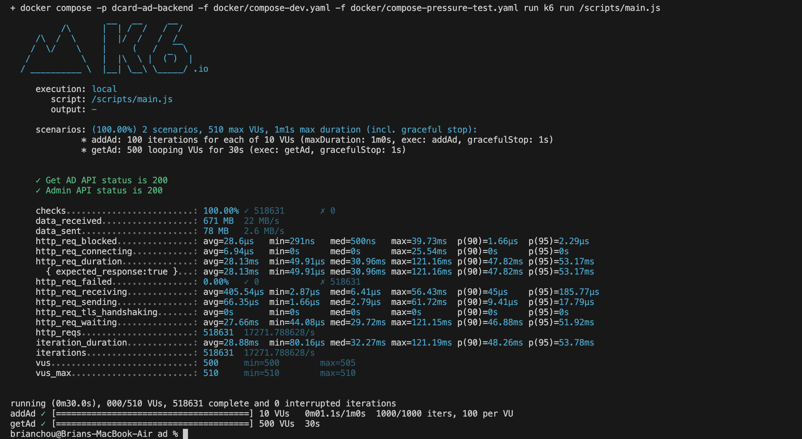

# Dcard Backend Intern Assignment

## Introduction

使用 Golang 設計並且實作一個簡化的廣告投放服務。該服務應該有兩個 API，一個用於產生廣告;一個用於列出廣告。詳細作業要求請參考 [這裡](https://drive.google.com/file/d/1dnDiBDen7FrzOAJdKZMDJg479IC77_zT/view)。
實作成果達到 [15000+ requests per second](#壓力測試結果)。

## Prerequisites

- Golang 1.22.0
- Docker

## 如何進行開發

在專案根目錄建立一個 `.env` 檔案，將 `.env.sample` 的內容複製到 `.env` 中，視需求修改裡面的內容。

在專案根目錄執行以下指令：

```bash
./scripts/cicd.sh DEV_UP
```

這個指令會使用Docker 建立 MongoDB、Redis 和 API 的容器。執行指令前請確認 Docker 已經啟動。 Windows 使用者可能需要使用 WSL 來執行這個指令。
如果想要在本機端執行，可以跑完上面指令後使用以下指令：

```bash
docker stop dcard-ad-backend-api-1
go run main.go
```

建議搭配 VSCode [REST Client](https://marketplace.visualstudio.com/items?itemName=humao.rest-client) 套件 和 `scripts/APITesting.http` 來進行 API 測試。

### 如何進行壓力測試
  
```bash
./scripts/cicd.sh PRESSURE_TEST
```

## 專案架構

```text
.
├── .devcontainer                    VSCode DevContainer 設定檔
├── api/
│   ├── get_ad_handler.go            GetAd API 主要程式碼所在
│   ├── post_create_ad_handler.go    PostAd API 主要程式碼所在
│   └── ...
├── assets/                          說明文件的圖片附件
│   └── ...
├── database/                        資料庫操作＆設定
│   ├── ad.go                        Mongo DB 針對廣告的相關操作
│   ├── database.go                  Mongo DB 設定
│   ├── redis.go                     Redis 針對廣告的相關操作
│   └── ...
├── docker/                          docker 相關文件
│   └── ...
├── model/                           整份程式共用的 Struct
│   └── ...
├── scripts/
│   ├── k6/
│   │   ├── main.js                  壓力測試的主要文件
│   │   └── ...
│   ├── APITesting.http              REST Client 測試檔案
│   ├── cicd.sh                      開發常用指令集
│   └── ...
├── main.go                          主程式
├── .env                             環境變數檔案
└── ...
```

## 壓力測試結果

17271.78 requests per second

設備:  
MacBook Air (M1, 2020, 16GB RAM, 512GB SSD)  
macOS Sonoma 14.4.1（23E224）  



## 想法 & 設計

### 資料庫選擇

第一階段 - MySQL  
一開始選擇使用 MySQL 作為資料庫，但是在實作 GetAd API 的時候發現 MySQL 廣告這種資料結構好像不太適合關連式資料庫（如果想擁有高效率資料表可能會超級奇怪）。

第二階段 - MongoDB  
在各種掙扎後決定改用 MongoDB 作為資料庫，並搭配其強大的 Aggregation 功能來查詢廣告。雖然效能提升了一點，而且資料儲存的結構也很漂亮，但由於我將大部分的搜尋計算都集中在 MongoDB 上，受限於手邊的硬體資源無法提升 MongoDB 的效能，所以在 GetAd API 上的效能提升不是很明顯。

第三階段 - Redis  
在觀察 MongoDB 的效能問題後，我發現造成瓶頸的原因主要有兩個：

1. 索引無法被有效利用
2. 我在 Aggregation 中使用了 `$group` 來將廣告按照 `ad_id` 分組，但這個操作非常耗時。且之後依照 `endAt` 來排序也因為不支援 in memory sorting 也相對耗時。

因此我改成如下的設計：  
新增廣告時將紀錄放入mongodb 中，同時分別依據該廣告的條件將廣告id 放入 redis 的ZSET（有序SET）中，
例如：  

新增一則廣告

```json
{
  "title": "AD 1",
  "startAt": "2024-04-05T03:44:51.546+00:00",
  "endAt": "2024-04-06T13:26:39.448+00:00",
  "conditions": {
    "ageStart": 10,
    "ageEnd": 12,
    "gender": ["F"],
    "country": ["TW", "JP"],
    "platform": ["ios"]
  }
}
```

則該廣告的廣告id 會被放入以下名稱的 zset， `ad:age:10`、`ad:age:11`、`ad:age:12`、`ad:country:TW`、`ad:country:JP`、 `ad:platform:ios` 並將 score 設定為該廣告的結束時間 。如此一來，當使用者呼叫 GetAd API 時，只需要從 Redis 中取得各個條件的 ZSET 取交集即可。

第四階段 - Redis + 預先計算  
不過上面的設計還是會因為受限於 Redis 的效能，所以我決定預先計算好各個條件的交集，並且設計成一段固定時間自動更新。這樣一來 GetAd API 就只需要從 Redis 中取得結果即可。同時將 Redis 調整成 Master-Slave 模式，透過讀寫分離降低 Redis 的壓力。

### Post Ad API 處理流程

1. 檢查廣告是否合法
2. 將廣告存入 MongoDB
3. 開一個 goroutine 依照上文所述的步驟來處理 Redis 的更新
4. 回傳廣告的 ID

### Get Ad API 處理流程

1. 將查詢條件轉換成 Redis ZSET 的 key
2. 根據 key 從 Redis 中取得 ZSET
3. 回傳結果

### Corn Job 處理流程

1. 每隔一段時間利用 MongoDB 的 Aggregation 找出當下時間點的活躍廣告，並儲存到 `current_ads` 這個 collection 中
2. 依照 `current_ads` 中的廣告資料更新 Redis 中的 ZSET
3. 計算所有可能的 Condition 排列組合，並重新計算交集和儲存結果
4. 重複上述步驟

## TODO

可以更好但是沒時間了

- [ ] 統一的錯誤處理和回傳格式
- [ ] 新增廣告時更新受影響的 Redis ZSET（這樣可以降低全部重新整理的頻率）
- [ ] 使用 Redis 因為各種原因失敗時的 fallback
